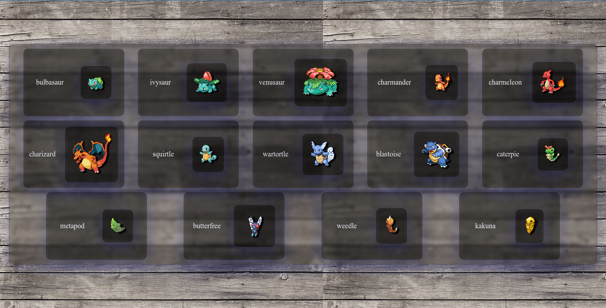
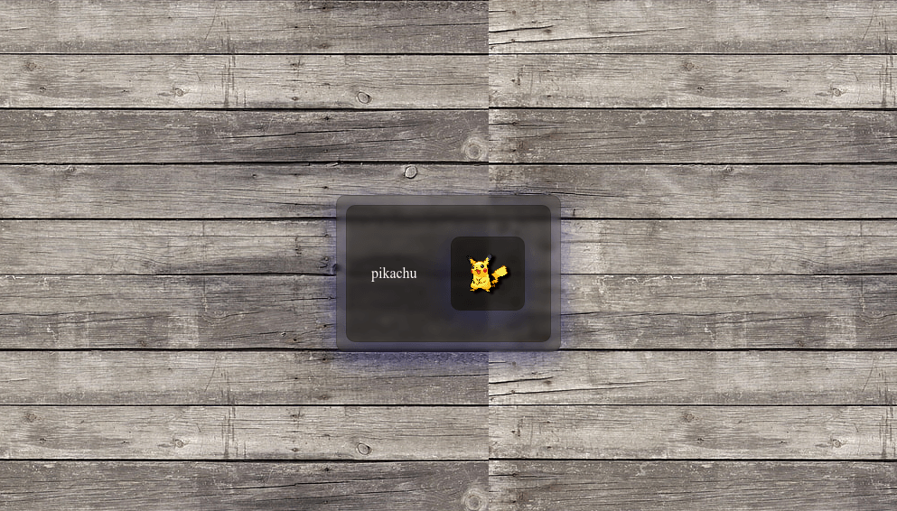
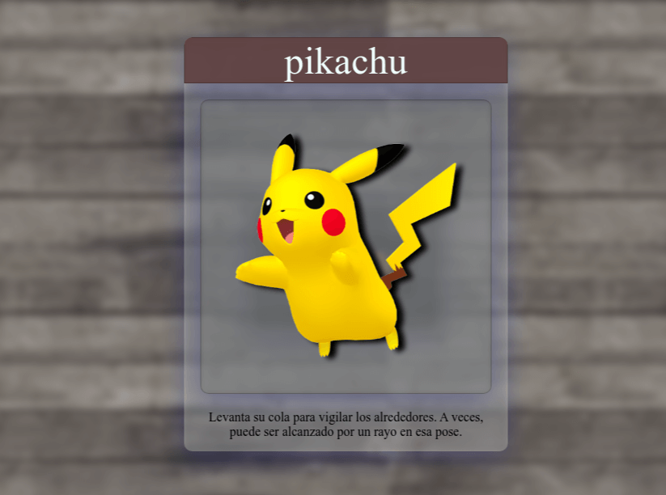
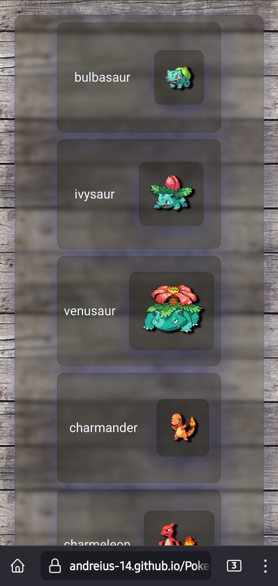

# Pokeapi-Voz-Gifs

---

[Poke-Voz](https://andreius-14.github.io/Pokeapi-Voz-Gifs/)

## Navegador

---

> Lista de Cartas de la Pokeapi, Insercion mediante Javascript  DOM, Empleamos Async y Await para mantener el Orden.
> 

> `Promt` Inserta la Cantidad de cartas que deseas .Si valor es errado por defecto imprimira la tarjeta Picachu
> 

> `Evento:` Al hacer click en la tarjeta brinda la imagen 3D y una dato sobre el pokemon. La web hace una lectura a Voz 💬 del Dato
> 

## Dispositivo Movil

---

